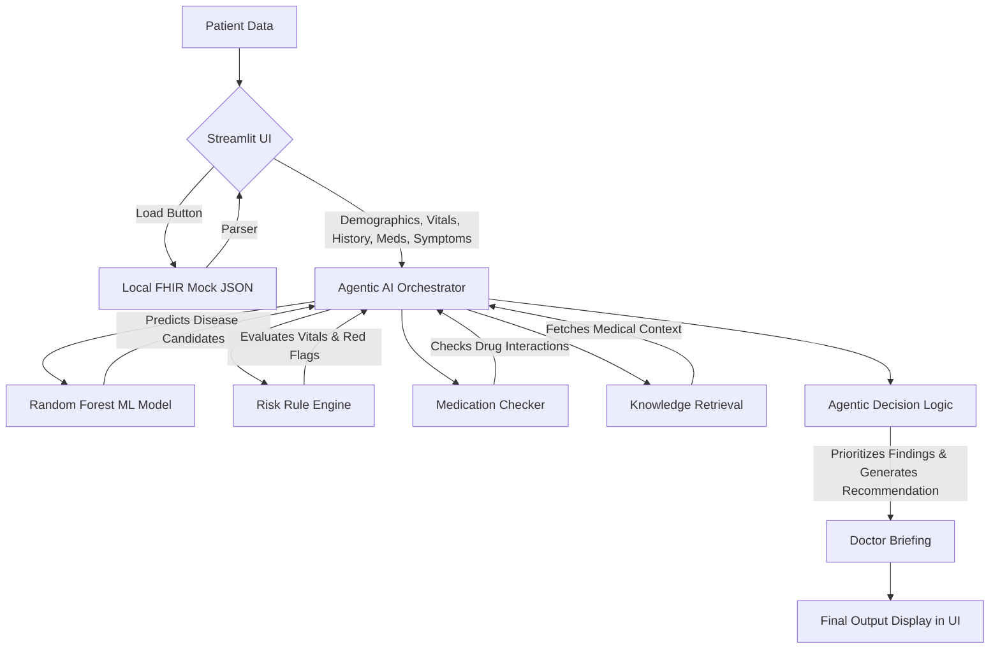

# Agentic AI in Healthcare – Intelligent Autonomous Diagnostic Assistant

This repository contains the source code for a B.Tech CSE Final-Year Project: **Agentic AI in Healthcare**. It is an AI-powered clinical decision-support prototype that leverages Machine Learning, FHIR (Fast Healthcare Interoperability Resources) data integration, and Agentic Reasoning to assist medical professionals.

> **Disclaimer:** This project is a strict **academic prototype**. It does not perform autonomous diagnosis, nor has it been clinically validated. All outputs are for demonstration purposes and are intended to demonstrate AI-assisted clinical decision support. The doctor remains the final decision-maker.

---

## 🌟 Key Features

1. **FHIR / EHR Integration**
   - Ingests mock Electronic Health Records (EHR) in the standard FHIR format (JSON).
   - Automatically parses patient demographics, medical history, vitals, and current medications.
   - Clean UI state-management to separate loaded EHR data from active manual clinical assessment.

2. **Machine Learning Diagnostic Engine**
   - Utilizes a Random Forest classifier trained on a deduplicated public symptom-disease dataset containing 132 symptom features.
   - Outputs top-5 disease candidates with probability and confidence levels (High/Moderate/Low).
   - Features 5-fold cross-validation demonstrating robust dataset-level performance.

3. **Vital-Risk Rules Engine**
   - Evaluates patient vitals (Temperature, Heart Rate, Blood Pressure, SpO₂) against critical thresholds.
   - Flags abnormal readings (e.g., Hypoxia, Hypertension, Fever) for priority review.

4. **Medication Interaction Checker**
   - Cross-references current patient medications (from FHIR or manual entry) against a localized knowledge base.
   - Flags drug-to-drug interactions categorized by severity (e.g., Aspirin + Warfarin = HIGH severity bleeding risk).

5. **Agentic Reasoning & Orchestration**
   - Synthesizes the ML predictions, vital risks, medication alerts, and retrieved medical knowledge.
   - Utilizes a priority-based logic tree to guide clinical next steps (e.g., Red flags trigger "URGENT CLINICAL REVIEW RECOMMENDED").
   - Generates a comprehensive **Doctor Briefing** summarizing all contexts into one unified actionable report.

6. **Interactive Streamlit UI**
   - Clean, modern, and responsive user interface.
   - Designed to mimic a real-world clinical workspace where a clinician can import EHR data, review it, and append manual symptom observations.

---

## 📂 Project Structure

```text
agent_ai/
│
├── app.py                         # Main Streamlit Application and Agentic Orchestrator
│
├── fhir/
│   ├── patient.json               # Mock FHIR R4 standard patient bundle
│   └── parser.py                  # FHIR parsing and extraction logic
│
├── knowledge/
│   ├── medical_knowledge.json     # Disease context knowledge base
│   ├── knowledge_retrieval.py     # Medical context retrieval logic
│   ├── medication_knowledge.json  # Drug interactions knowledge base
│   └── medication_checker.py      # Drug safety rules engine
│
├── data/                          # Dataset files (Training/Testing)
├── preprocess_data.py             # Data cleaning & preprocessing pipeline
├── eda.py                         # Exploratory Data Analysis script
├── train_model.py                 # Random Forest and XGBoost model training
├── cross_validation.py            # 5-fold CV evaluation
├── predict.py                     # Standalone ML inference script
└── README.md                      # Project documentation
```

---

## 🚀 Getting Started

### Prerequisites

Ensure you have Python 3.9+ installed. It is recommended to use the provided virtual environment (`.venv`).

Required libraries (can be installed via standard pip requirements):
- `streamlit`
- `pandas`
- `scikit-learn`
- `xgboost`
- `matplotlib` / `seaborn` (for EDA)

### Running the Application

To launch the full Agentic AI Healthcare Assistant UI, run the following command from the project root:

```bash
python -m streamlit run app.py
```

The application will be accessible in your web browser at `http://localhost:8501`.

---

## 🧪 Testing the Pipeline

You can simulate a complete end-to-end clinical workflow using the provided mock data:

1. **Load FHIR Patient:** Click the `Load FHIR Patient` button in the sidebar/UI. This will read `fhir/patient.json` (Patient: Rahul Sharma) without overwriting manual form inputs.
2. **Import Data:** Click `Use FHIR Data for Assessment` to import the EHR vitals, demographics, and medications into the active clinical assessment form.
3. **Add Symptoms:** In the manual symptoms input box, type `vomiting, abdominal_pain`.
4. **Assess:** Click the `🔍 ASSESS PATIENT` button.
5. **Review Output:** Watch the Agentic Orchestrator run the ML model, Vital Risk engine, Medication checker, and output the final **Doctor Briefing**.

You can also test specific safety edges, such as manually adding `warfarin` to a patient already taking `aspirin`, or lowering the SpO₂ to `89` to see the vital-risk engine intercept the ML outputs with safety warnings.

---

## 🏗️ Architecture Overview

The system follows a modular architecture orchestrated by `app.py`:



---

## 🔒 Safety & Limitations

- **Model Constraints:** The Random Forest model is strict and accepts only 132 predefined binary symptom features. Demographics, vitals, and medications are routed exclusively through the logic/rules engines, bypassing the ML model to maintain feature integrity.
- **Mock FHIR Data:** The FHIR JSON bundle is synthetically generated and does not correspond to any real patient data.
- **Clinical Validation:** The system is an academic proof-of-concept for Agentic coordination in healthcare IT. It is not FDA-approved, nor does it have real-world clinical validation.
