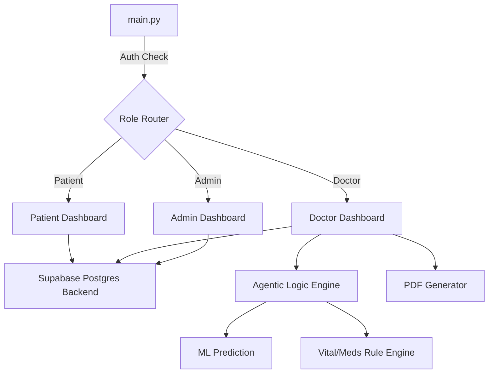

# Agentic AI in Healthcare – Intelligent Autonomous Diagnostic Assistant

This repository contains the source code for a B.Tech CSE Final-Year Project: **Agentic AI in Healthcare**. It is an AI-powered clinical decision-support prototype that leverages Machine Learning, FHIR (Fast Healthcare Interoperability Resources) data integration, and Agentic Reasoning to assist medical professionals.

> **Disclaimer:** This project is a strict **academic prototype**. It does not perform autonomous diagnosis, nor has it been clinically validated. All outputs are for demonstration purposes and are intended to demonstrate AI-assisted clinical decision support. The doctor remains the final decision-maker.

---

## 🌟 Key Features

1. **Role-Based Workspaces & Supabase Auth**
   - Secure routing isolating **Patients**, **Doctors**, and **Administrators** into distinct, purpose-built dashboards.
   - Built on a robust Supabase PostgreSQL backend using lightweight `MemoryStorage` to guarantee ultra-fast, widget-safe rendering.

2. **Machine Learning Diagnostic Engine**
   - Utilizes a Random Forest classifier trained on a deduplicated public symptom-disease dataset containing 132 symptom features.
   - Outputs top-5 disease candidates with probability and confidence levels (High/Moderate/Low).
   
3. **Automated Discharge PDF Generation**
   - Generates beautifully branded, downloadable PDF Discharge Summaries using `reportlab`.
   - Incorporates dynamic patient vitals, medications, and doctor annotations directly from the Postgres backend.

4. **Premium UI/UX System**
   - Developed using custom injected CSS and Streamlit's new container features.
   - Features a deeply styled dark-mode sidebar, premium pill-shaped segmented tabs, and fluid micro-animations for an ultra-modern clinical feel.

5. **FHIR / EHR Integration**
   - Ingests Electronic Health Records (EHR) in the standard FHIR format.
   - Clean UI state-management to separate loaded EHR data from active manual clinical assessment.

6. **Agentic Reasoning & Orchestration**
   - Synthesizes ML predictions, vital risks (e.g., Hypoxia, Hypertension), medication alerts (e.g., Aspirin + Warfarin), and retrieved medical knowledge.
   - Utilizes a priority-based logic tree to guide clinical next steps (e.g., Red flags trigger "URGENT CLINICAL REVIEW RECOMMENDED").

---

## 📂 Project Structure

```text
healthcare-agentic-ai/
├── main.py                     # Main application entry point & Role Router
├── .env                        # Environment variables (Supabase Config)
├── requirements.txt            # Project dependencies
├── README.md                   # Project documentation
│
├── src/                        # Main source code directory
│   ├── pages/                  # Streamlit workspaces
│   │   ├── login.py
│   │   ├── patient_dashboard.py
│   │   ├── doctor_dashboard.py
│   │   └── admin_dashboard.py
│   │
│   ├── services/               # External APIs, DB, & Utilities
│   │   ├── supabase_client.py  # Supabase Postgres integration & Auth
│   │   ├── hospital_client.py  # Mock hospital HIS network client
│   │   └── pdf_generator.py    # Reportlab PDF discharge summaries
│   │
│   ├── agents/                 # Agentic logic and routing
│   │   ├── hospital_routing_agent.py
│   │   └── patient_assessment.py
│   │
│   ├── ml/                     # Machine Learning pipeline and inference
│   │   └── predict.py
│   │
│   └── knowledge/              # Knowledge base scripts and logic
│       ├── medication_checker.py
│       └── expand_knowledge.py
```

---

## 🚀 Getting Started

### Prerequisites & Installation

Ensure you have Python 3.9+ installed. Because modern Linux distributions enforce externally managed Python environments (PEP 668), it is highly recommended to use a virtual environment to install dependencies.

1. **Create a virtual environment:**
   ```bash
   python -m venv venv
   ```

2. **Activate the virtual environment:**
   - On Linux/macOS: `source venv/bin/activate`
   - On Windows: `venv\Scripts\activate`

3. **Install the required libraries:**
   ```bash
   pip install streamlit pandas scikit-learn xgboost matplotlib seaborn python-dotenv supabase reportlab
   ```

4. **Environment Variables:**
   Ensure you create a `.env` file in the root directory containing your Supabase credentials:
   ```env
   SUPABASE_URL=your_supabase_url
   SUPABASE_KEY=your_supabase_anon_key
   ```

### Running the Application

Launch the full Agentic AI Healthcare Assistant UI from the project root:

```bash
python -m streamlit run main.py
```

The application will be accessible in your web browser at `http://localhost:8501`.

---

## 🏗️ Architecture Overview

The system follows a modular, state-driven architecture orchestrated by `main.py`:



## ⚡ Performance Optimization
The application features a strict sequential execution model using `@st.cache_data`. Previous multi-threaded concurrent DB calls were stripped to remove `CachedWidgetWarnings` and internal state deadlocks, drastically improving load times and UI thread stability.

---

## 🔒 Safety & Limitations

- **Model Constraints:** The Random Forest model is strict and accepts only 132 predefined binary symptom features.
- **Academic Context:** The system is an academic proof-of-concept for Agentic coordination in healthcare IT. It is not FDA-approved, nor does it have real-world clinical validation.
